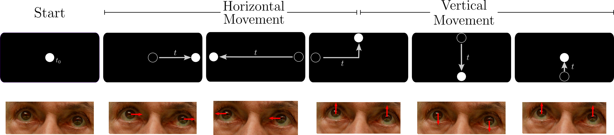
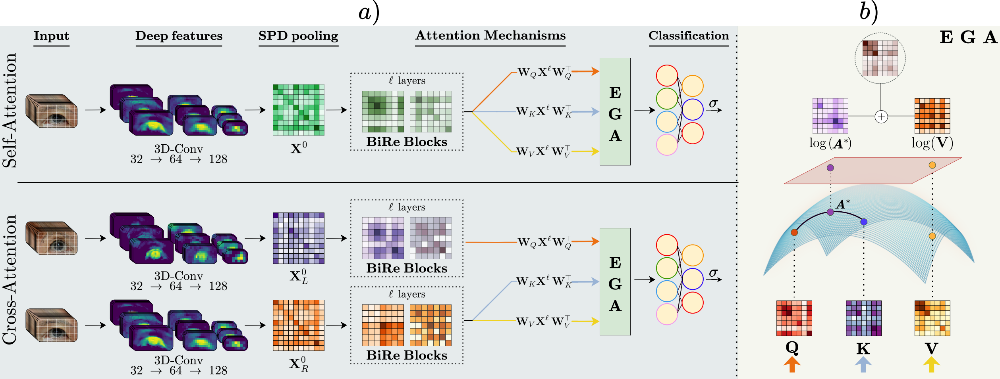

# EGA: Enhanced Geodesic Attention for SPEM oculomotor Parkinson Quantification
 
This repository is related to the paper entitled: *"EGA: Enhanced Geodesic Attention for SPEM oculomotor Parkinson Quantification"* (Under revision).
 
Luis Fernando Celis <sup>1</sup>, Juan Olmos <sup>1,2</sup>, Fabio Martínez <sup>1*</sup>
 
<sup>1</sup> Biomedical Imaging, Vision and Learning Laboratory (BIVL²ab), Universidad Industrial de Santander (UIS), Bucaramanga 680002, Colombia.
 
<sup>2</sup> Computer Science and Systems Engineering Laboratory (U2IS), ENSTA Paris, Institut Polytechnique de Paris, 828, Boulevard des Maréchaux, Palaiseau, 91762, France.
 
Binary classification of Parkinson's disease (PD) vs. healthy controls from eye-tracking video, using an attention mechanism that operates natively on the **Symmetric Positive Definite (SPD) manifold** via Riemannian geometry.
 
---
 
## Smooth Pursuit Eye Movement task
 
<p align="center">
  
</p>
Participants follow a single dot describing horizontal and vertical trajectories on a screen, while a 60 FPS camera records the eye region. Each direction lasts approximately 7 seconds. The task exposes subtle oculomotor abnormalities, such as reduced saccadic velocity, impaired pursuit, binocular asymmetry, that are sensitive to PD even at prodromal stages.
 
## Pipeline
 
<p align="center">
  
</p>
A 3D-CNN extracts spatio-temporal features from the eye video, which are summarized into an SPD covariance matrix via covariance pooling. After ℓ BiRe blocks (BiMap + ReEig) progressively compress the descriptor on the SPD manifold, the **Enhanced Geodesic Attention (EGA)** module performs attention as a geodesic operation on the manifold itself, preserving the matrix-valued second-order structure rather than collapsing it to a scalar similarity. A final log-Euclidean projection followed by a linear classifier outputs the prediction.
 
## Two variants
 
| Variant | Class | Mode | Input |
|---|---|---|---|
| **EGA (monocular)** | `EGA` | `attention_mode = "self"` | Single eye video `(C, T, H, W)` |
| **CrossATT (binocular)** | `CrossATT_64Bire_32AttLEFT` | `attention_mode = "cross"` | Paired left + right eye videos |
 
The **CrossATT** binocular variant processes left and right eye streams through **independent** 3D-CNN encoders and BiMap projections, then performs **cross-attention** where the left eye acts as *query* and the right eye as *key / value*:
 
```
left  ──3D-CNN──►  SPD_left  ──BiMap──►  Q
right ──3D-CNN──►  SPD_right ──BiMap──►  K, V
 
EGA(Q, K, V)  →  linear  →  prediction
```
 
This lets the model exploit inter-ocular asymmetry, a feature with clinical relevance in early PD.
 
---
 
## Dataset structure
 
Eye-tracking recordings are stored as frame sequences. Folders are named with a 3-character prefix:
 
- `P00 … P24` — Parkinson's disease patients (label = 1)
- `C00 … C24` — Healthy controls (label = 0)

**layout** 
```
data/monocular_frames/
├── P00_left/
├── P00_right/
├── C00_left/
├── C00_right/
└── ...
```
 
Frames are subsampled every `subsampling_step` frames (default 6), yielding ~150 frames per video.
 
**5-fold cross-validation.** Each validation fold contains exactly 5 PD + 5 control subjects, drawn without replacement from the 25+25 cohort; the remaining 40 subjects train.

---
  
## Usage
 
1. Set `data_root_dir` and `output_root_dir` at the top of `src/train.py`.
2. Choose `attention_mode`: `"self"` (monocular) or `"cross"` (binocular).
3. Run:
```bash
cd src
python train.py
```
 
Outputs are written to `output_root_dir/models/<run_name>/`:
 
| File | Contents |
|---|---|
| `parameters.json` | Hyperparameters and final metrics |
| `trainingVal_info.csv` | Per-batch loss, accuracy, predictions |
| `output.log` | Training log |
| `fold-{i}_best.pt` | Best checkpoint per fold (lowest val loss) |
| `fold-{i}_last.pt` | Last-epoch checkpoint per fold |
 
---
 
## Repository structure
 
```
EGA-PD-oculomotor/
├── src/
│   ├── train.py                  ← entry point
│   ├── models/
│   │   └── ega.py                ← EGA and CrossATT model classes
│   ├── data/
│   │   ├── dataloader.py         ← EyeVideoDataset, LateralVideoDataset, fold splits
│   │   └── transforms.py         ← augmentation
│   ├── utils/
│   │   └── utils.py              ← date stamp, DataLoader seed, parameter count
│   └── libs/
│       ├── spdnetwork/
│       │   ├── functional.py     ← eigendecomposition, bilinear map, geodesics
│       │   ├── nn.py             ← SPD layers: BiMap, ReEig, LogEig, CovPool, EGA
│       │   └── optimizers.py     ← MixOptimizer 
└── README.md
```
  
---
 
## License
 
Released for research and educational purposes.
 
---
 
## Citation
 
If you use this code or build on this work, please cite:
 
```bibtex
@article{celis2025ega,
  title={EGA: Enhanced Geodesic Attention for SPEM oculomotor Parkinson Quantification},
  author={Celis, Luis Fernando and Olmos, Juan and Mart{\'\i}nez, Fabio},
  journal={Authorea Preprints},
  year={2025},
  publisher={Authorea}
}
```
